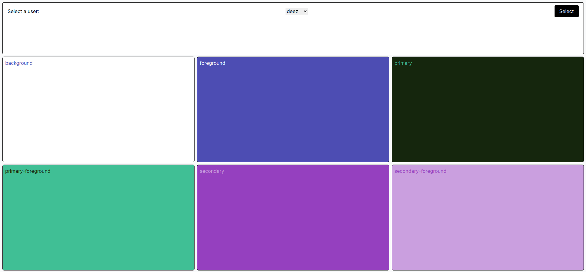

# SSR CUSTOM TAILWIND THEME DEMO

This is a demo of a custom Tailwind theme using form actions and a simples endpoint to generate the CSS file.

> There be dragons here!

## HOW IT WORKS

We use CSS variables as values for our `tailwind.config.ts` config file. Then we use a simple endpoint to generate the CSS file with the values from the "database" based on a cookie (It could be anything else).

## PROBLEMS

- The CSS file is generated on every request, so it's not a good idea to use this in production without working on the cache thing.
- The CSS file is generated on the server, so if you need to do some post-processing on the CSS file, you need to do it on the server.
- Changing the user in the form doesn't update the CSS file, so you need to refresh the page to see the changes.
